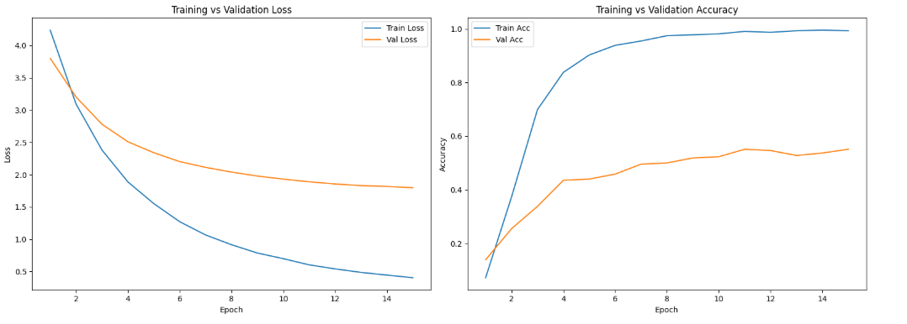
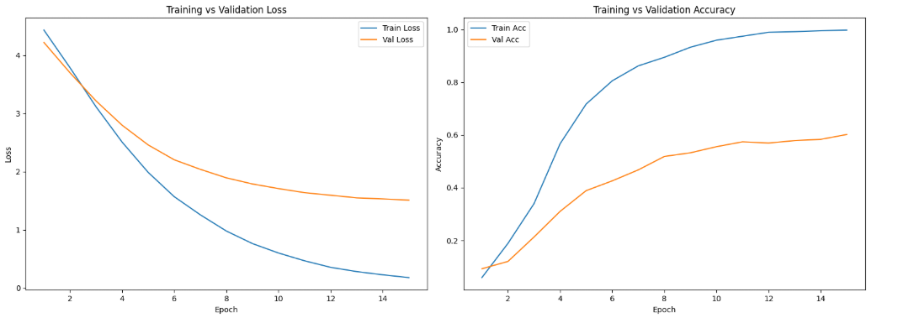
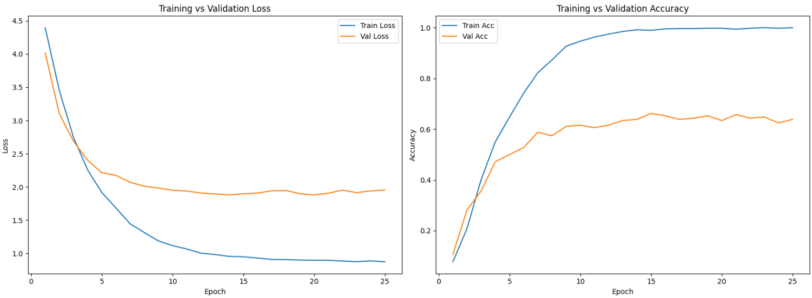
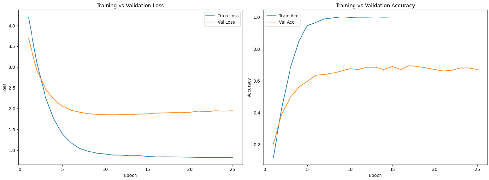
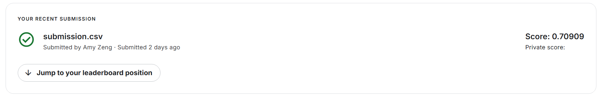

# Image Classifier

## Transfer Learning Challenge

March 2026

## 1. Introduction

The goal of this challenge is to be able to effectively utilize transfer learning techniques in order to create a model that achieve high test accuracy. The main crux of this challenge is how small the dataset is. Transfer learning is suitable for this issue because of the large number of classes and small number of images per class. Using a model from scratch would be extremely difficult compared to using transfer learning because it is much easier to use a model that is already trained to recognize some patterns rather than trying to build that recognition from close to nothing.

In order use a transfer learning model effectively, it must be carefully selected to suit the issue at hand. My main approach was to start from an extremely naive model, only using the loaded model and resizing transforms and an unfrozen classifier head. From then, I tried to improve accuracy by creating more complex augmentations, unfreezing more layers, and more complex learning rate schedules. At the end, I was able to achieve approximately 70% accuracy.

## 2. Dataset

There are a total of 100 classes, labeled 0-99. The train set has a total of 1,079 images and the test set contained 1,036 unlabeled images.

In terms of data preprocessing, I used only `Resize` to resize images to 224 x 224, `ToTensor`, and, of course, `Normalize`. My normalization parameters follow the ones used in ImageNet. These are the transforms used for the test and validation sets. For the training set, `RandomResizedCrop` was used to create a bit more variation in cropping, along with `RandomHorizontalFlip`, `ColorJitter`, and the aforementioned basic transforms.

## 3. Implementation

### 3.1 Pretrained backbone used

I started off by trying out some of the different ResNet models: ResNet-18, ResNet-34, and ResNet-50. Out of the three, ResNet-50 performed the best, so that is what I used for a while. However, after the in-class presentations, I saw that people had a lot of success with using ConvNeXt-Tiny, so I ended up switching and found major improvements in performance.

### 3.2 Architecture changes

In terms of architecture changes, I kept it extremely minimal, with only unfreezing the classifier head and adjusting it for this task using `nn.Linear(in_features, num_classes)`, as well as unfreezing later backbone stages to do some partial fine-tuning. Everything else stayed the same. I didn't do any additional pooling or dropout.

### 3.3 Fine-tuning strategy

I unfroze layers one-by-one, of course starting with the classifier head, then I worked backwards and assessed the performance of the model as I unfroze more layers. Unfreezing too many layers could lead to overfitting, so I stopped when I was no longer able to see any more improvements in performance. I did not employ any sort of unfreezing schedule, and instead opted for a static unfreezing schedule to avoid adding unnecessary complexity.

## 4. Training

I opted to use cross-entropy loss for this challenge, as it is a classification problem, with `label_smoothing=0.1` in order to reduce overconfidence. I used the AdamW optimizer with a `weight_decay=1e-5`.

For the classifier layer, I went with a slightly higher learning rate of `3e-4`, while for stages 3-4, I opted for a slightly lower learning rate of `3e-5`. I experimented a lot with batch sizes, as I found that it actually had a bigger impact than I initially thought. I started with a batch size of 64, then scaled down to 32, 16, and 8. I found that 16 performed the best while taking a reasonable amount of time to complete training, so that is what I ended up with.

To determine the number of epochs, I simply trained until I could see the performance plateau, while keeping it relatively low for faster training time. I trained on my NVIDIA GeForce RTX 3080 and used PyTorch version `2.10.0+cu126`.

## 5. Experiments

My methodology was quite straightforward in terms of training, starting from the most basic setup possible and trying out different hyperparameters and PyTorch features. The main issue that I faced throughout the entire training process was overfitting, which was to be expected. Therefore, I focused more on aspects that could slightly offset overfitting, and I would only keep changes that made a meaningful impact on the performance.

I didn't end up keeping every superficial change, even if it didn't hurt the performance, because I believed that added complexity would only make my model much harder to reason about and diagnose, which was one of the pitfalls that I ran into while trying to optimize the ResNet-50 model.

In order to determine what needed to change, I'd use a combination of the results of local plots and accuracy, as well as the Kaggle accuracy. Looking at the plots was really good for diagnosing overfitting. Overall, I noticed a trend of train accuracy being marginally higher than validation accuracy, so based on that, I would try out different augments and freezing strategies, and learning rates.

## 6. Results

I have several plots from different phases of the training process.

### 6.1 ResNet-50 with basic transforms



*Figure 1: ResNet-50 with only basic transforms.*

### 6.2 ResNet-50 with layer 4 unfrozen



*Figure 2: ResNet-50 with layer 4 unfrozen.*

### 6.3 ResNet-50 with added augmentation



*Figure 3: ResNet-50 with added augmentation, layers 3 and 4 unfrozen, and learning-rate scheduler.*

### 6.4 ConvNeXt-Tiny



*Figure 4: ConvNeXt-Tiny with added augmentation, layer 4 unfrozen, and learning-rate scheduler.*

### 6.5 Final Kaggle test accuracy



*Figure 5: Final Kaggle Set Accuracy.*

### 6.6 Kaggle submission

For my Kaggle submission, I loaded the weights from a checkpoint, created predictions, then converted the model predictions back into dataset labels. Then, I made sure to build the submission file in the desired format. To submit, I simply used:

```powershell
kaggle competitions submit -c ucsc-cse-144-winter-2026-final-project -f submission.csv -m "msg"
```

## 7. Discussion

Out of everything, the biggest impact on accuracy was the model used. I observed a significant performance boost simply by switching from ResNet to ConvNeXt-Tiny. I think that this is the case because ConvNeXt-Tiny is a more modern model that removes a lot of issues that older models like ResNet struggle with, like bottlenecks and lack of regularization. It uses layer normalization, which allows for slightly better behavior with small batch sizes, which is suitable for a small dataset like this one.

I found that, in general, overfitting was an issue that I was consistently fighting. However, employing strategies such as dropout would reduce overfitting, but it would not improve accuracy, no matter how I tuned the other hyperparameters. Additionally, I strayed away from doing too many additional augmentations to discourage any unnecessary noise.

While this model achieves decent accuracy, it is possible that the overfitting might cause the model to have poor generalization capabilities. Something that I would have liked to do next would be to use a different training/validation split, perhaps employ K-Fold validation to try and reduce overfitting.

## 8. Reproducibility

These are the seed values that I have fixed for reproducibility:

```python
torch.manual_seed(42)
random.seed(42)
np.random.seed(42)
torch.backends.cudnn.deterministic = True
torch.backends.cudnn.benchmark = False
```

I had my environment set up in Windows PowerShell, using a Python 3.13.1 virtual environment to run the Jupyter Notebook. The requirements to run the program, as well as the package versions, are defined in `requirements.txt`.

To set up your environment for running, create and activate your Python virtual environment. Then, run:

```powershell
pip install requirements.txt
```

This installs all required dependencies for the program. Then, navigate to the `v2.ipynb` file and click the **Run all cells** button. When execution is finished, a file containing model weights and a submission file should be produced.

### Project files

- [Final model weights (Google Drive)](https://drive.google.com/file/d/1vM6QCEXNOfhCsIIaPQdTt-xW9J1JYvLU/view?usp=sharing)
- [GitHub repository](https://github.com/Inkyuuu/CSE144FinalProject)

## 9. References

- [`torchvision.transforms`](https://docs.pytorch.org/vision/stable/transforms.html)
- [`torchvision.datasets.ImageFolder`](https://docs.pytorch.org/vision/stable/generated/torchvision.datasets.ImageFolder.html)
- [`torchvision.models.convnext_tiny`](https://docs.pytorch.org/vision/stable/models/generated/torchvision.models.convnext_tiny.html)
